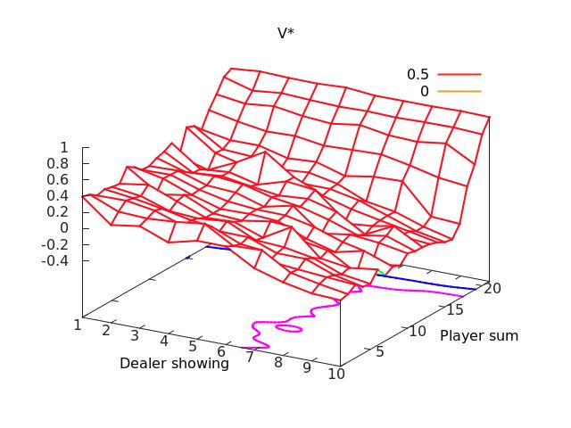

Easy21
======

Assignment from David Silver's [Reinforcement Learning course](http://www0.cs.ucl.ac.uk/staff/D.Silver/web/Teaching.html). Coded for clarity, not efficiency.

Requires [Torch7](http://torch.ch/) with the [Moses](https://github.com/Yonaba/Moses) package.

Run `monte-carlo.lua` first to generate Q* and the plot of V (below), then `sarsa-lambda.lua` and `lin-fun-approx.lua` to generate their plots.

